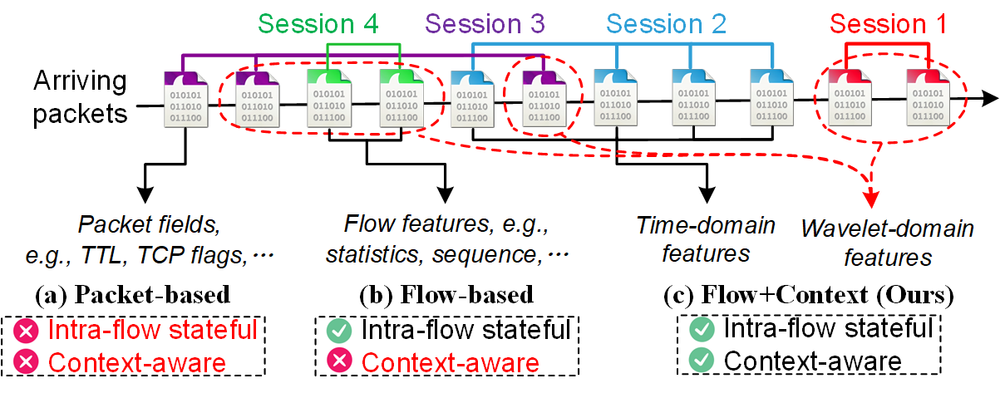

# Towards Context-Aware Traffic Classification via Time-Wavelet Fusion Network



## Introduction

TrafficScope is a time-wavelet fusion network based on Transformer to enhance the performance of encrypted traffic classification. Specifically, in addition to using intra-flow semantics, TrafficScope also extracts contextual information to construct more comprehensive representations. Moreover, to cope with the non-stationary and dynamic contextual traffic, we employ wavelet transform to extract invariant features. For feature fusion, the cross-attention mechanism is adopted to inline combine temporal and wavelet-domain features. 


## How to Use

- Split: Use ./SplitCap.exe to divide PCAP traffic into 5-tuple sessions.
- Dataset: Use ./dataset_gen.py to generate the required temporal features and wavelet-domain features. 
- Model: The ./models.py file contains three components of the model, i.e., the Temporal Encoder, the Contextual Encoder, and the Fusion Encoder.
- Train and Test: The ./train_test.py file corresponds to model training and testing. 
- Robustness: The ./robustness.py file refers to the robustness evaluation in terms of packet loss, retransmission, and out-of-order. 

## Deployment Requirements

Hardware:
- 40 GbE NIC: [DPDK-supported hardwares](https://core.dpdk.org/supported/)
  - e.g., Intel XL710-QDA2

Software:
- Ubuntu 16.04.1 LTS
- Python 3.7
- [DPDK 20.11](http://git.dpdk.org/dpdk-stable/tag/?h=v20.11)
- Pktgen 20.03.0

## Converting Model

- Input: Extract raw bytes of the PCAP traffic and save them as CSV files. 
- Config: Modify the model parameters and dataset path in ./convert_model/config.json. 
- Converting model: Directly train decision trees, or convert the trained DNN into decision trees. 
- Generating rules: Use ./convert_model/tree_to_rule.py to generate byte-rules from the decision tree model. 

## Dataplane

- Install DPDK 20.11 following [Getting Started Guide for Linux](https://doc.dpdk.org/guides-20.11/linux_gsg/index.html).
- Compile DPDK applications.
- Install byte-rules
	```
	./dpdk-ip_pipeline -l 0-7 -- -s ./demo_rule.cli
	```
- Use pdump to capture packets
	```
	./dpdk-pdump -- --pdump 'port=0,queue=*,rx-dev=/tmp/rx.pcap,tx-dev=/tmp/tx.pcap,ring-size=65536' --pdump 'port=1,queue=*,rx-dev=/tmp/rx2.pcap,ring-size=65536'
	```
- Use Pktgen to send packets
	```
	./pktgen -l 0-4 -n 4 -- -P -m [1].0 -m [2].1 -m [3].2 -m [4].3 -s 0:./demo.pcap -s 1:./demo.pcap -s 2:./demo.pcap -s 3:./demo.pcap
	```


### References
- [New Directions in Automated Traffic Analysis](https://doi.org/10.1145/3460120.3484758), 	Jordan Holland, Paul Schmitt, Nick Feamster, Prateek Mittal - CCS 2021
- [FS-Net: A Flow Sequence Network For Encrypted Traffic Classification](https://ieeexplore.ieee.org/document/8737507/), Chang Liu, Longtao He, Gang Xiong, Zigang Cao, Zhen Li - INFOCOM 2019
- [FlowLens: Enabling Efficient Flow Classification for ML-based Network Security Applications](https://www.ndss-symposium.org/ndss-paper/flowlens-enabling-efficient-flow-classification-for-ml-based-network-security-applications/), Diogo Barradas, Nuno Santos, Luís Rodrigues, Salvatore Signorello, Fernando M. V. Ramos, André Madeira - NDSS 2021
- [ET-BERT: A Contextualized Datagram Representation with Pre-training Transformers for Encrypted Traffic Classification](https://dl.acm.org/doi/10.1145/3485447.3512217), Xinjie Lin, Gang Xiong, Gaopeng Gou, Zhen Li, Junzheng Shi, Jing Yu - WWW 2022
- [Realtime Robust Malicious Traffic Detection via Frequency Domain Analysis](https://dl.acm.org/doi/10.1145/3460120.3484585), Chuanpu Fu, Qi Li, Meng Shen, Ke Xu - CCS 2021
- [Detecting Unknown Encrypted Malicious Traffic in Real Time via Flow Interaction Graph Analysis](https://www.ndss-symposium.org/ndss-paper/detecting-unknown-encrypted-malicious-traffic-in-real-time-via-flow-interaction-graph-analysis/), Chuanpu Fu, Qi Li, Ke Xu - NDSS 2023
- [FlowPrint: Semi-Supervised Mobile-App Fingerprinting on Encrypted Network Traffic](https://www.ndss-symposium.org/ndss-paper/flowprint-semi-supervised-mobile-app-fingerprinting-on-encrypted-network-traffic/), Thijs van Ede, Riccardo Bortolameotti, Andrea Continella, Jingjing Ren, Daniel J. Dubois, Martina Lindorfer, David Choffnes, Maarten van Steen, Andreas Peter - NDSS 2020
