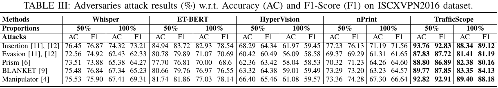

# Rebuttal for NDSS#515 

## Towards Context-Aware Traffic Classification via Time-Wavelet Fusion Network

### To Reviewer\#A\#C: About Manuscript Presentation

For the context information representation, it will be modeled by the cross-attention mechanism combined with FoI, as described in IV.D and Figure 6. Intuitively, the context information will eventually affect different attention (as shown in Figure 4) weights to help distinguish flow (to be detected), to cope with such as exhaustion attack detection problem. 

We thank the reviewers for their suggestions on the presentation of the manuscript, including giving an example in the Abstract, reshaping the presentation of the wavelet design, presenting a running example throughout the design section, and some minor typos. We will improve and polish them. 

### To Reviewer\#B: Details of Dataset

The number of labels for IDS, CrossNet, VPN, and AndMal are 8, 20, 13, and 5. Some datasets (such as IDS and VPN) are indeed a bit old, but they are still frequently used in recent works (e.g., CCS2021\_nPrint, USENIX2023\_Rosetta, WWW2023\_TFE-GNN, COSE2023\_Adaptive, KDD2022\_FlowFormer), so we also consider them for evaluation. 

### To Reviewer\#D: About Manuscript Writing

We are grateful to reviewer D for constructive comments on the writing. 
Empty connection floods are DDoS attacks designed to saturate the targeted open port’s sockets, its attack traffic is no different from the normal three-way handshake (refer to https://kb.mazebolt.com/knowledgebase/empty-connection-flood/). We will reorganize the section II into Backound/Preliminary knowledge for a better presentation. We will reshape the presentation of the adversary model and assumptions and avoid using confusing sentences. Intrusion detection includes both benign traffic and attack traffic. VPN dataset does not involve attack traffic. We will provide a detailed description in the dataset section in V.A. 

### To Reviewer\#B\#C\#D: Robustness and Adversarial Attack

We evaluate the robustness of TrafficScope against various forms of adversarial attacks (USENIX\_BLANKET, JSAC\_Manipulator, TIFS\_Prism) and evasion attacks (Insertion and Evasion from NDSS\_SymTCP and CCS\_Themis). Regardless of whether we set the attack ratio to 50\% or 100\%, the results show that TrafficScope is the most robust on all four datasets, with a $\sim$10\% higher accuracy and F1 score than baselines. This is due to TrafficScope's ability to combine contextual information for analysis, reducing the impact of a single flow being tampered with. Detailed results are reported as follows. 

### To Reviewer\#B\#D: Concept Drift Evaluation

For the cross-dataset experiments of V.F in the manuscript, we further supplement to clarify the concerns about concept drift. We supplement the experimental results of the baseline model in three cross-dataset scenarios, and it is clear that TrafficScope outperforms the baseline by $>$15\% accuracy and F1 score. Detailed results are reported as follows. Meanwhile, we conducted ablation experiments on the drift of content and FoI. The results show that when only FoI drifts or context drifts, the performance of TrafficScope is only slightly affected. In real scenarios, the occurrence of concept drift is gradual, the background traffic and FoI may not change suddenly simultaneously. In addition, some new research (NDSS2023\_OWAD) on drift sample adaptation can also be combined with TrafficScope, and we will supplement these descriptions. 

### To Reviewer\#C: For Extended Experiments

Given that nPrint integrates automated machine learning (AutoML), intuitively, standard machine learning should not perform as well as nPrint when the features are the same. In addition, we fed the hidden feature representation of TrafficScope to five standard ML models. The results showed an improvement compared to the baseline. Therefore, we can conclude that the performance of TrafficScope benefits from the feature extraction of context + FoI on the one hand, and from the tailor-made Transformer and cross-attention mechanism on the other. pVoxel focuses on identifying false positives for existing ML-based traffic detection systems, and we will discuss its combination with TrafficScope. TrafficScope is currently mainly applied to raw PCAP traffic for analysis, we will add some discussions on its application to the large-scale DARPA OpTC dataset with Zeek logs to provide more insights. 

**We express our sincere gratitude to all reviewers for their valuable time and constructive comments, which indeed helped us to further improve the manuscript.**

## References

- [USENIX_BLANKET] Nasr M, Bahramali A, Houmansadr A. Defeating {DNN-Based} traffic analysis systems in {Real-Time} with blind adversarial perturbations[C]//30th USENIX Security Symposium (USENIX Security 21). 2021: 2705-2722.
- [JSAC_Manipulator] Han D, Wang Z, Zhong Y, et al. Evaluating and improving adversarial robustness of machine learning-based network intrusion detectors[J]. IEEE Journal on Selected Areas in Communications, 2021, 39(8): 2632-2647.
- [TIFS_Prism] Li W, Zhang X Y, Bao H, et al. Prism: Real-Time Privacy Protection Against Temporal Network Traffic Analyzers[J]. IEEE Transactions on Information Forensics and Security, 2023.
- [NDSS_SymTCP] Wang Z, Zhu S. SymTCP: Eluding stateful deep packet inspection with automated discrepancy discovery[C]//Network and Distributed System Security Symposium (NDSS). 2020.
- [CCS_Themis] Wang Z, Zhu S, Man K, et al. Themis: Ambiguity-aware network intrusion detection based on symbolic model comparison[C]//Proceedings of the 2021 ACM SIGSAC Conference on Computer and Communications Security. 2021: 3384-3399.
- [NDSS2023_OWAD] Han, Dongqi, et al. "Anomaly Detection in the Open World: Normality Shift Detection, Explanation, and Adaptation." NDSS. 2023.
- [WWW2023_TFE-GNN] Zhang H, Yu L, Xiao X, et al. TFE-GNN: A Temporal Fusion Encoder Using Graph Neural Networks for Fine-grained Encrypted Traffic Classification[C]. WWW, 2023.
- [WWW2023_AppSniffer] Oh S, Lee M, Lee H, et al. AppSniffer: Towards Robust Mobile App Fingerprinting Against VPN[C]. WWW, 2023.
- [WWW2022_ET-BERT] Lin X, Xiong G, Gou G, et al. Et-bert: A contextualized datagram representation with pre-training transformers for encrypted traffic classification[C]. WWW, 2022.
- [KDD2022_PacRep] Meng X, Wang Y, Ma R, et al. Packet representation learning for traffic classification[C]. KDD, 2022.
- [KDD2022_FlowFormer] Zhao R, Deng X, Yan Z, et al. MT-FlowFormer: A Semi-Supervised Flow Transformer for Encrypted Traffic Classification[C]. KDD, 2022.
- [INFOCOM2022_Mousika] Xie G, Li Q, Dong Y, et al. Mousika: Enable general in-network intelligence in programmable switches by knowledge distillation[C]. INFOCOM, 2022.
- [INFOCOM2024_RIDS] Zhao Z, Li Z, Song Z, et al. RIDS: Towards Advanced IDS via RNN Model and Programmable Switches Co-Designed Approaches[C]. INFOCOM, 2024.
- [USENIX2023_Rosetta] Xie R, Wang Y, Cao J, et al. Rosetta: Enabling robust tls encrypted traffic classification in diverse network environments with tcp-aware traffic augmentation[C]. USENIX Security, 2023.
- [CCS2021_nPrint] Holland J, Schmitt P, Feamster N, et al. New directions in automated traffic analysis[C]. CCS, 2021.
- [TDSC2023_I2RNN] Song Z, Zhao Z, Zhang F, et al. I2RNN: An Incremental and Interpretable Recurrent Neural Network for Encrypted Traffic Classification[J]. IEEE TDSC, 2023.
- [TDSC2023_ERNN] Zhao Z, Li Z, Jiang J, et al. ERNN: Error-Resilient RNN for Encrypted Traffic Detection towards Network-Induced Phenomena[J]. IEEE TDSC, 2023.
- [COMNET2023_FastTraffic] Xu Y, Cao J, Song K, et al. FastTraffic: A lightweight method for encrypted traffic fast classification[J]. Computer Networks, 2023.
- [COSE2023_Adaptive] Olímpio Jr G, Camargos L, Miani R S, et al. Model update for intrusion detection: Analyzing the performance of delayed labeling and active learning strategies[J]. Computers & Security, 2023.
- [RAID2023_Flow-MAE] Hang Z, Lu Y, Wang Y, et al. Flow-MAE: Leveraging Masked AutoEncoder for Accurate, Efficient and Robust Malicious Traffic Classification[C]. RAID, 2023.
- [ToN2023_ProGraph] Li W, Zhang X Y, Bao H, et al. ProGraph: Robust network traffic identification with graph propagation[J]. IEEE/ACM ToN, 2022.